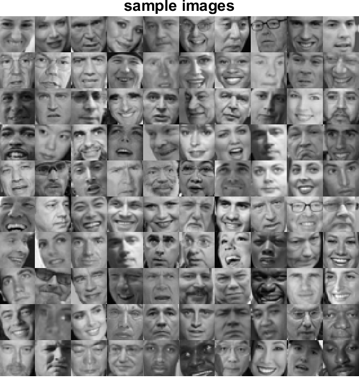
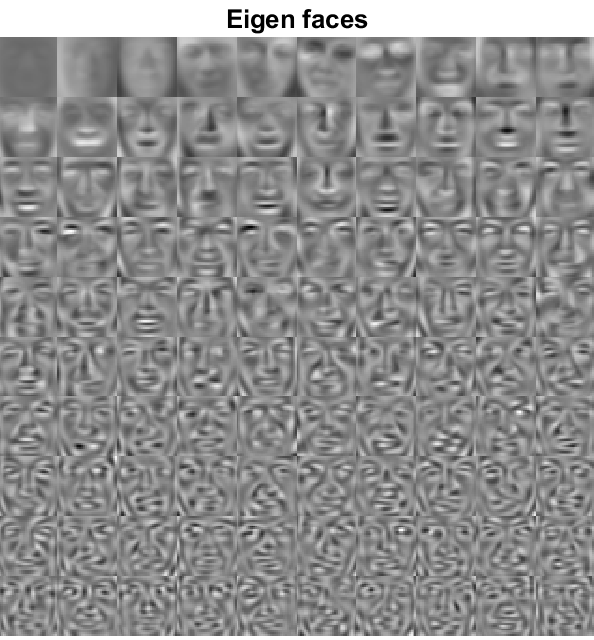
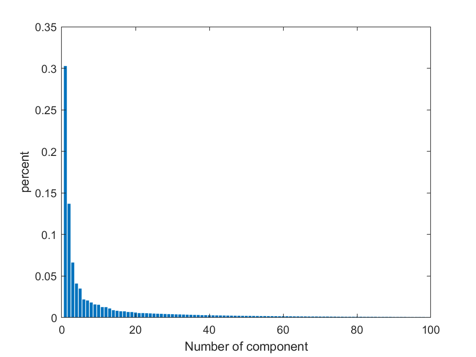
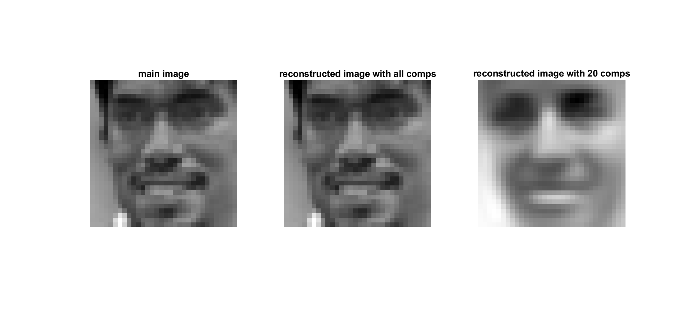

# Eigenface
In this project we use face images to extract eigenfaces.
## image sample
you can use 'faces.mat' dataset for further usages. Figure in following demonstrates some saples of this dataset.

## extract eigen faces and eigenvalues
images are '32x32' pixels thus we vectorized all the images to '1024' vectors and calculate covariance matrix.
By exploiting Singular Value Decomposition (SVD), eigenvectors and eigenvalues extracted. 
you can see eigenfaces by reshaping '1024' eigenvector shape to a '32x32' eigenface image.

the following histogram demonstrates most significant eigenvectors with respect to amount of eigenvalue.

## reconstruct a face using eigenfaces
The following figure shows a face that reconstructed with all of eigenfaces and the first 20 of eigenfaces.
It is obvious we can completely reconstruct the image using the whole eigenfaces. 

